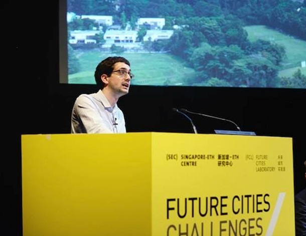

My teaching focuses on building practical skills for analysing complex environmental problems, combining clear conceptual foundations with hands-on engagement with real data. I emphasise pedagogical approaches that support active skill development, including scaffolded exercises, applied projects, and iterative feedback. I integrate innovative and asynchronous learning formats—such as live and hands-on coding tutorials, interactive datasets, and self-paced analytical tasks. The aim is to make technical skills accessible across diverse disciplinary backgrounds while allowing students to learn flexibly and progressively build confidence in using and interpreting data for decision-making.

## Introduction to AI for ecology

This short course introduces ecologists and environental scientists to modern AI tools, with a focus on large language models. It is aimed at people who are familiar with the R programming language, but no detailed background knowledge of AI is required. The course focuses on using and understanding the limitations of a range of Generative AI tools and their applications to topics like simulating human land-use decisions, summarising literature, developing retrieval augmented generation (RAG) systems, and building simple chatbots. Recorded presentations and interactive coding sessions will be available in future.

-   [Session 1: Overview and getting set up](session-1-started.qmd)\ Coming soon as a recorded lecture.

-   [Session 2: Large Language Models](session-2-llms.qmd)\
    Introduction to LLMs and simple prompting workflows in R. [Download the R script](files/session-2-llms.R)

-   [Session 3: Chatbots](session-3-chatbots.qmd)\
    Building a basic chatbot and introducing retrieval-augmented generation. [Download the R script](files/session-3-chatbots.R)

-   [Session 4: Chatbot Interfaces](session-4-chatbots-continued.qmd)\
    Improving usability with icons, styling, and disclaimers. [Download the R script](files/session-4-chatbots-continued.R)

## Modelling ecosystem services using R

Short tutorials for understanding how to run ecosystem services models for high-resolution datasets, including LiDAR-derived vegetation height and digital elevation model datasets. The tutorials focus on the [hbrc](https://github.com/manaakiwhenua/hbrc) package for R. The course materials can be downloaded [here](files/intro-hbrc-v3.pdf).

## Guest lectures

Recent guest lectures include: 
*Principles of Ecology for Design*. Experimentación y Exploración Proyectual 2. Catholic University of Argentina in Buenos Aires. [Download the slides](files/DRR-061025-CUABA.pdf).
*Ecosystem services for landscape planning and design*. Nanjing Agricultural University. [Download the slides](files/DRR-080725-NAU.pdf).
