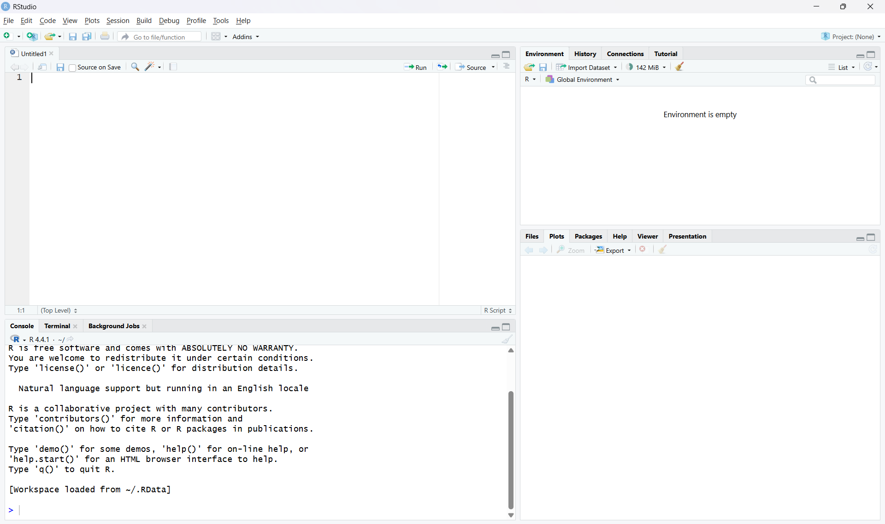

## Overview

This session introduces the software setup needed for the rest of the course. By the end of this page, you should have:

-   R installed
-   RStudio installed
-   Ollama installed and tested
-   the main R packages for the course installed
-   a basic understanding of how to create an OpenAI API account

Most of the later sessions will make much more sense if you complete this setup first.

## 1. Install R and RStudio

R is the programming language we will use throughout the course, and RStudio is the interface we will use to write and run code.

### Install R

First, [install R](https://cran.r-project.org/) on your computer. Choose the version that matches your operating system.

After installation, open R once to make sure it starts correctly.

### Install RStudio

Next, [install RStudio Desktop](https://posit.co/downloads/). RStudio is an integrated development environment that makes it much easier to work with R scripts, packages, and projects.

After installation, open RStudio and check that it detects your R installation.

You should see:

-   a Console pane
-   a Source editor pane
-   an Environment pane
-   a Files/Plots/Packages/Help pane

Example screenshot of a fresh RStudio session:



## 2. Create a course project folder

It is a good idea to keep all course materials together in one project folder.

For example, you might create a folder structure like this:

```{text}
AIcourse/
  Data/
  Scripts/
  www/
```

This makes it easier to keep track of scripts, datasets, PDFs, and any images used in Shiny apps.

If you are using RStudio, you may also want to create an RStudio Project for this folder.

## 3. Install Ollama

Some of the course examples use local open-source language models. We will run these using Ollama.

[Install Ollama](https://ollama.com/) for your operating system and then open a terminal or command prompt.

Before moving on, it is useful to check that R can communicate with Ollama.

First, load the ollamar package:

```{r}
#| eval: false
#| echo: true
library(ollamar)
```

We can then ask Ollama which models are currently installed on the system.

```{r}
#| eval: false
#| echo: true
list_models()
```

If Ollama is installed and running correctly, this command should return a list of the locally available models.

For example, the output might look something like this:

```{text}
name              size
tinyllama:1.1b    637 MB
```

If no models are listed yet, we can download one directly from R. A small model that runs on most laptops is TinyLlama.

```{r}
#| eval: false
#| echo: true
pull("tinyllama:1.1b")
```

This will download the model to your computer. In Session 2, we will interact with the model.

## 4. Install the required R packages

We will use a number of R packages during the course. You only need to install each package once.

Run the following in the R console:

```{r}
#| eval: false
install.packages(c(
  "ellmer",
  "ollamar",
  "pdftools",
  "shiny",
  "shinychat",
  "bslib",
  "ragnar"
))
```

After installation, test that the packages load correctly:

```{r}
#| eval: false
library(ellmer)
library(ollamar)
library(pdftools)
library(shiny)
library(shinychat)
library(bslib)
library(ragnar)
```

If all packages load without errors, your R environment is ready for the rest of the course.

## 5. Test the connection between R and Ollama

Before moving on, it is useful to check that R can communicate with Ollama.

For example:

```{r}
#| eval: false
library(ollamar)
list_models()
```

If everything is working, this should return the local models currently installed through Ollama.

You can also try a simple chat example later in the course using `chat_ollama()`.

## 6. Optional: check your working directory

It is often useful to know where R is looking for files.

```{r}
#| eval: false
getwd()
```

In a well-organised project, your working directory should usually be the main course folder or your RStudio project folder.

## 7. Setting up an OpenAI API account

Some of the course examples use OpenAI models. To use these, you will need an OpenAI API account and an API key. If you prefer not to use OpenAI, that is completely OK and **very** understandable. You may use any Generative AI provider, as long as they work with the R package [ellmer](https://ellmer.tidyverse.org/). A full explanation of useable platforms can be found in the ellmer documentation.

The general process is:

1.  Create an OpenAI Platform account [here](https://openai.com/api/).
2.  Add billing details if required.
3.  Create an API key.
4.  Keep the API key private.
5.  Load the key into R using an environment variable.

A simple example in R is:

```{r}
#| eval: false
Sys.setenv(OPENAI_API_KEY = "your_key_here")
```

A safer long-term approach is to store the key outside your script, for example in an `.Renviron` file.

For example:

```{text}
OPENAI_API_KEY=your_key_here
```

This helps avoid accidentally sharing your key in scripts or on GitHub.

### Important notes about API keys

-   Treat your API key like a password.
-   Do not paste it into code that you plan to share publicly.
-   Do not upload it to GitHub.
-   API use may incur costs depending on the model and usage.

## 8. Checklist

Before moving on to Session 2, make sure that you can do all of the following:

-   open RStudio successfully
-   run R code in the console
-   load the required packages
-   run `ollama` via R
-   pull and test a small local model
-   understand how an OpenAI API key would be added securely

## Summary

In this session we installed the main software needed for the course and checked that it was working correctly. This included R, RStudio, Ollama, and the main R packages. We also introduced the basic idea of using an OpenAI API key safely. Once this setup is complete, you are ready to begin working with language models in R.
