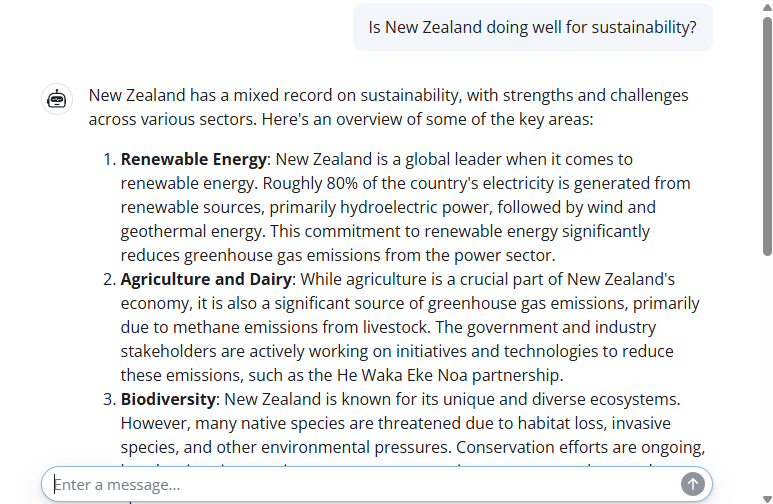
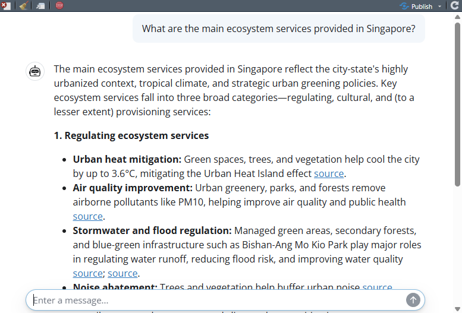
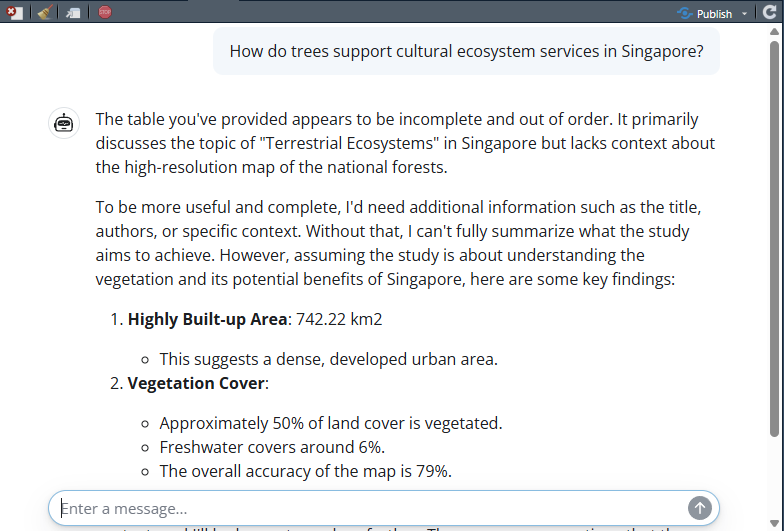

## Overview

In this session we build simple chatbots in R. We start with a basic chatbot powered by ChatGPT, then extend it using retrieval augmented generation (RAG) so that the chatbot can draw on a specific body of literature. Finally, we look at an open-source version using local models.

[Download the R script](files/session-3-chatbots.R)

## Packages

```{r}
#| eval: false
#| echo: false
require(ellmer)
require(ollamar)
require(shinychat)
require(shiny)
require(ragnar)
require(bslib)
```

## 1. A simple chatbot using ChatGPT

We begin by building a very simple chatbot interface using the `shinychat` package. The user interface is created with `chat_ui()` inside a Shiny page.

```{r}
#| eval: false
#| echo: false
ui <- bslib::page_fluid(
  chat_ui("chat")
)
```

Next we define a server function that connects the app to an OpenAI model. The chatbot is given a system prompt telling it that it should behave as an expert on global sustainability.

```{r}
#| eval: false
server <- function(input, output, session) {
  chat <- ellmer::chat_openai(
    model = "gpt-4o",
    system_prompt = "You are an expert on global sustainability."
  )

  observeEvent(input$chat_user_input, {
    stream <- chat$stream_async(input$chat_user_input)
    chat_append("chat", stream)
  })
}
```

To launch the app, we would run:

```{r}
#| eval: false
shinyApp(ui, server)
```

Example appearance of the chatbot:



## 2. Retrieval augmented generation

For better responses in a chatbot, we can use retrieval augmented generation, or RAG. This allows us to provide a dataset of reference material that the chatbot can search when answering questions.

In this example, we import a dataset of summaries of academic papers about ecosystem services in Singapore. You can download this dataset [here](files/sgliterature2.csv).

```{r}
#| eval: false
ragin <- read.csv("data/sgliterature2.csv")
ragin[1,]
```

The dataset contains three columns: a bibliographic reference, a DOI link, and summary text describing the main findings.

RAG uses a data store. Here we set up a DuckDB-based store using the `ragnar` package.

```{r}
#| eval: false
store_location <- "data/sglit.duckdb"
```

The following code shows how a new store could be created from scratch using OpenAI embeddings.

```{r}
#| eval: false
embedder <- \(x) ragnar::embed_openai(x, model = "text-embedding-3-small")

store <- ragnar_store_create(
  store_location,
  embed = embedder,
  version = 1,
  name  = "sg_literature",
  title = "Singapore ecosystem services",
  extra_cols = data.frame(
    reference = character(),
    doi_url   = character(),
    text      = character()
  )
)

ragnar_store_insert(store, ragin)
ragnar_store_build_index(store)
```

Once the store has been built and saved, we can reconnect to it later without rebuilding it.

```{r}
#| eval: false
store <- ragnar_store_connect(store_location)
```

We then create a chat client and register the knowledge store as a retrieval tool.

```{r}
#| eval: false
client <- chat_openai(
  model = "gpt-4.1",
  system_prompt = "You are an expert on nature in Singapore, especially ecosystem services and natural capital. You have access to one knowledge store tool.
The 'SGES' knowledge store contains summaries of relevant scientific publications.
If no relevant results are found, inform the user and do not attempt to answer the question.
If the user request is ambiguous, perform at least one search first, then ask a clarifying question.
For referencing the SGES knowledge store, use a hyperlink to the provided 'doi_url' data field.
You can also provide a bibliography from the full citation details provided in the 'reference' field."
)

ragnar_register_tool_retrieve(
  client, store,
  top_k = 20,
  name = "SGES",
  store_description = "Use for published scientific literature about ecosystem services and biodiversity in Singapore."
)
```

The server structure is similar to the previous example, except now the client has access to the retrieval tool.

```{r}
#| eval: false
server <- function(input, output, session) {
  chat <- client

  observeEvent(input$chat_user_input, {
    stream <- chat$stream_async(input$chat_user_input)
    chat_append("chat", stream)
  })
}
```

To launch the app, we would run:

```{r}
#| eval: false
shinyApp(ui, server)
```

Example appearance of the RAG chatbot:



This seems like quite a successful result. The chatbot is pulling real data from some of the papers in our RAG database. From here, it is able to provide key facts such as the 3.6 °C temperature reduction from urban vegetation. Even better, it is providing a hyperlink for people to go and read the original papers.

## 3. Open-source version

We can also build a similar RAG-enabled chatbot using open-source local models. In this case we need both an embedding model and a conversational model.

First we pull an embedding model for the retrieval store.

```{r}
#| eval: false
ollamar::pull("nomic-embed-text")
```

We also need a conversational model that supports tool use. Most small LLMs cannot support tool use, because it requires a bit more "reasoning" complexity. Here we use a very small version of Qwen2.5.

```{r}
#| eval: false
ollamar::pull("qwen2.5:0.5b")
```

Next we define the location of the open-source store.

```{r}
#| eval: false
Ostore_location <- "data/sglitOPEN.duckdb"
```

The following code shows how the store could be built from scratch using Ollama embeddings.

```{r}
#| eval: false
embedderOPEN <- \(x) ragnar::embed_ollama(x, model = "nomic-embed-text")

Ostore <- ragnar_store_create(
  Ostore_location,
  embed = embedderOPEN,
  version = 1,
  name  = "sg_literature_open",
  title = "Singapore ecosystem services",
  extra_cols = data.frame(
    reference = character(),
    doi_url   = character(),
    text      = character()
  )
)

ragnar_store_insert(Ostore, ragin)
ragnar_store_build_index(Ostore)
```

Once again, if the store already exists we can simply reconnect to it.

```{r}
#| eval: false
Ostore <- ragnar_store_connect(Ostore_location)
```

We then create the client and register the retrieval tool.

```{r}
#| eval: false
Oclient <- chat_ollama(
  model = "qwen2.5:0.5b",
  system_prompt = "You are an expert on nature in Singapore, especially ecosystem services and natural capital. You have access to one knowledge store tool.
The 'SGES' knowledge store contains summaries of relevant scientific publications.
If no relevant results are found, inform the user and do not attempt to answer the question.
If the user request is ambiguous, perform at least one search first, then ask a clarifying question.
For referencing the SGES knowledge store, use a hyperlink to the provided 'doi_url' data field.
You can also provide a bibliography from the full citation details provided in the 'reference' field."
)

ragnar_register_tool_retrieve(
  Oclient, Ostore,
  top_k = 20,
  name = "SGES",
  store_description = "Use for published scientific literature about ecosystem services and biodiversity in Singapore."
)
```

Finally we define the server for the open-source chatbot.

```{r}
#| eval: false
Oserver <- function(input, output, session) {
  chat <- Oclient

  observeEvent(input$chat_user_input, {
    stream <- chat$stream_async(input$chat_user_input)
    chat_append("chat", stream)
  })
}
```

To launch the open-source app, we would run:

```{r}
#| eval: false
shinyApp(ui, Oserver)
```

Example appearance of the open-source chatbot:



We can see that this seems quite a bit less successful than when using the more powerful OpenAI LLM. The model appears to be able to retrieve information from the RAG but has not successfully found information relevant to the question. This is NOT a reflection on the utility of open-source models, but reflects the compact model that we chose. A more complex open-source model would likely give great results, but we might need a powerful local computing option.

## Summary

In this session we built a simple chatbot, then extended it using retrieval augmented generation so that it could draw on a specific knowledge base. We also explored an open-source version using local models. These examples show how chatbots can be made more useful and more transparent by giving them access to relevant external information.
