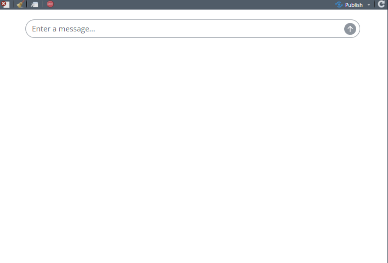
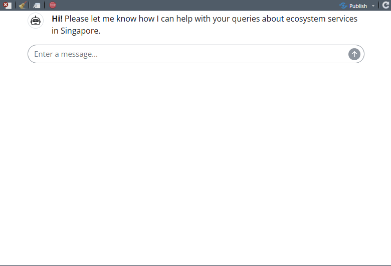
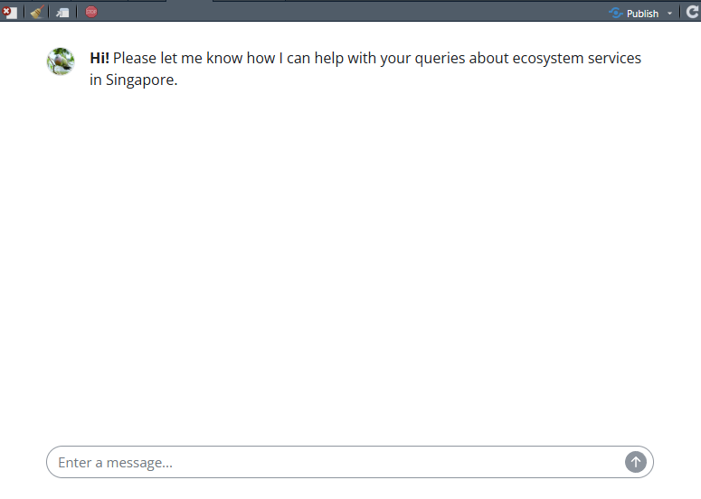
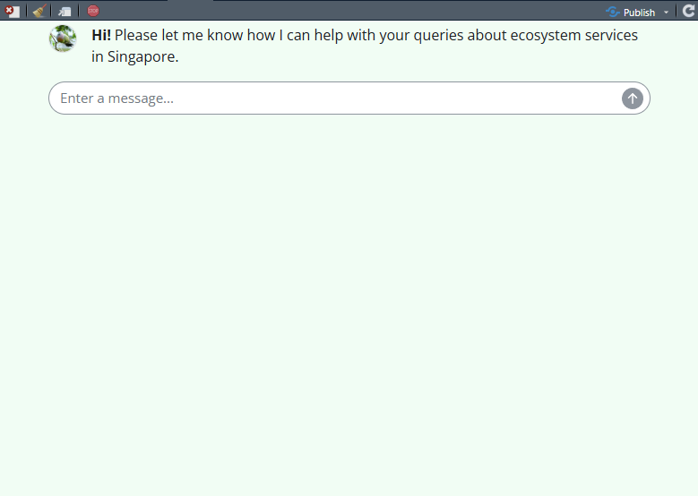
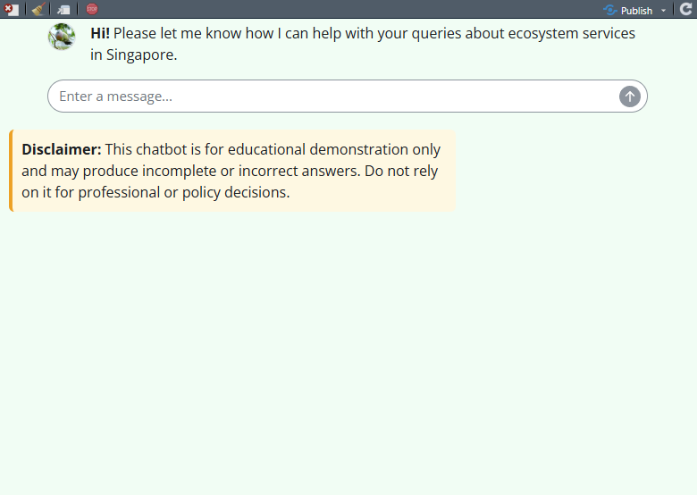

## Overview

In this session we continue developing chatbots in R, with a focus on user interface and usability. We begin with a simple chatbot and then gradually improve it by adding a welcome message, a custom assistant icon, a more attractive colour scheme, and a disclaimer.

[Download the R script](files/session-4-chatbots-continued.R)

## Packages

```{r}
#| eval: false
require(ellmer)
require(ollamar)
require(shinychat)
require(shiny)
require(ragnar)
require(bslib)
```

## 1. Initial chatbot

This session focuses on user interface and usability issues for chatbots. We start with a simple example and then polish it up. For this experiment we use a simple chatbot without retrieval augmented generation, but the same design ideas also apply to the RAG models from the previous session.

We begin by setting up a basic interface using `chat_ui()` from the `shinychat` package.

```{r}
#| eval: false
ui <- bslib::page_fluid(
  chat_ui("chat")
)
```

Next we define a server function with an OpenAI-powered model.

```{r}
#| eval: false
server <- function(input, output, session) {
  chat <- ellmer::chat_openai(
    model = "gpt-4o",
    system_prompt = "You are an expert on nature in Singapore, especially ecosystem services and natural capital."
  )

  observeEvent(input$chat_user_input, {
    stream <- chat$stream_async(input$chat_user_input)
    chat_append("chat", stream)
  })
}
```

To launch the app, we would run:

```{r}
#| eval: false
shinyApp(ui, server)
```

Example appearance of the initial chatbot:

 Well, it looks like a chatbot, but it is pretty sparse!

## 2. Adding a welcome message

A welcome message can be added when creating the user interface. This helps orient the user and makes the chatbot feel more approachable.

```{r}
#| eval: false
ui <- bslib::page_fluid(
  chat_ui(
    "chat",
    messages = list(
      "**Hi!** Please let me know how I can help with your queries about ecosystem services in Singapore."
    )
  )
)
```

The server code stays the same.

```{r}
#| eval: false
server <- function(input, output, session) {
  chat <- ellmer::chat_openai(
    model = "gpt-4o",
    system_prompt = "You are an expert on nature in Singapore, especially ecosystem services and natural capital."
  )

  observeEvent(input$chat_user_input, {
    stream <- chat$stream_async(input$chat_user_input)
    chat_append("chat", stream)
  })
}
```

To launch the app, we would run:

```{r}
#| eval: false
shinyApp(ui, server)
```

Example appearance with a welcome message:

 Much more welcoming!

## 3. Adding a custom icon

Custom icons can also be added when creating the interface. In Shiny, images must usually be served from a folder called `www` in the same folder as the app.

In this example, the chatbot is about Singapore, so we use a photo of a local bird: a Pink-necked Green Pigeon (*Treron vernans*). The original photo was taken by [Fung Tze Kwan](https://www.nus.edu.sg/cncs/fung-tze-kwan/), a brilliant ecologist at the National University of Singapore.

You can download this beautiful pigeon [here](files/pngp.png).

```{r}
#| eval: false
addResourcePath("assets", file.path(getwd(), "www"))
```

We can then define the interface with a custom assistant icon.

```{r}
#| eval: false
ui <- page_fillable(
  chat_ui(
    "chat",
    messages = list(
      list(
        role = "assistant",
        content = "**Hi!** Please let me know how I can help with your queries about ecosystem services in Singapore."
      )
    ),
    icon_assistant = tags$img(
      src = "assets/pngp.png",
      width = "32px",
      height = "32px",
      style = "border-radius: 50%; object-fit: cover;"
    )
  )
)
```

The server is unchanged apart from using the same model and prompt.

```{r}
#| eval: false
server <- function(input, output, session) {
  chat <- ellmer::chat_openai(
    model = "gpt-4o",
    system_prompt = "You are an expert on nature in Singapore, especially ecosystem services and natural capital."
  )

  observeEvent(input$chat_user_input, {
    stream <- chat$stream_async(input$chat_user_input)
    chat_append("chat", stream)
  })
}
```

To launch the app, we would run:

```{r}
#| eval: false
shinyApp(ui, server)
```

Example appearance with a custom icon:

 Such a cute pigeon, makes all the difference to the vibe.

## 4. Changing the colour scheme

We can also customise the colour scheme. This requires adding some HTML and CSS styling, so it is a little more involved than the previous changes.

The colours are given as hexadecimal colour values.

```{r}
#| eval: false
addResourcePath("assets", file.path(getwd(), "www"))

ui <- bslib::page_fluid(
  tags$style(HTML("
    /* Whole page background */
    body {
      background-color: #f0fdf4;
    }

    /* Assistant message bubble */
    #chat .shinychat-assistant .shinychat-message-body {
      background-color: #bbf7d0;
    }

    /* User message bubble */
    #chat .shinychat-user .shinychat-message-body {
      background-color: #dbeafe;
    }
  ")),

  chat_ui(
    "chat",
    messages = list(
      list(
        role = "assistant",
        content = "**Hi!** Please let me know how I can help with your queries about ecosystem services in Singapore."
      )
    ),
    icon_assistant = tags$img(
      src = "assets/pngp.png",
      width = "32px",
      height = "32px",
      style = "border-radius: 50%; object-fit: cover;"
    )
  )
)
```

The server code remains the same.

```{r}
#| eval: false
server <- function(input, output, session) {
  chat <- ellmer::chat_openai(
    model = "gpt-4o",
    system_prompt = "You are an expert on nature in Singapore, especially ecosystem services and natural capital."
  )

  observeEvent(input$chat_user_input, {
    stream <- chat$stream_async(input$chat_user_input)
    chat_append("chat", stream)
  })
}
```

To launch the app, we would run:

```{r}
#| eval: false
shinyApp(ui, server)
```

Example appearance with a customised colour scheme:

 It is amazing how a spot of paint can make something feel much mpore user friendly. This has real "90's ecology website" appeal now.

## 5. Adding a disclaimer

Because chatbots can produce incomplete or incorrect answers, it is often a good idea to include a disclaimer. In this example we add a small warning box below the chatbot.

```{r}
#| eval: false
disclaimer_text <- "This chatbot is for educational demonstration only and may produce incomplete or incorrect answers.
Do not rely on it for professional or policy decisions."
```

We then incorporate the disclaimer into the user interface.

```{r}
#| eval: false
addResourcePath("assets", file.path(getwd(), "www"))

ui <- bslib::page_fluid(
  tags$style(HTML("
    /* Whole page background */
    body {
      background-color: #f0fdf4;
    }

    /* Assistant message bubble */
    #chat .shinychat-assistant .shinychat-message-body {
      background-color: #bbf7d0;
    }

    /* User message bubble */
    #chat .shinychat-user .shinychat-message-body {
      background-color: #dbeafe;
    }
  ")),

  chat_ui(
    "chat",
    messages = list(
      "**Hi!** Please let me know how I can help with your queries about ecosystem services in Singapore."
    ),
    icon_assistant = tags$img(
      src = "assets/pngp.png",
      width = 32,
      height = 32,
      style = "border-radius: 50%;"
    )
  ),

  div(
    style = "
      margin-top: 15px;
      padding: 10px;
      border-left: 4px solid #f59e0b;
      background-color: #fff8e1;
      border-radius: 6px;
      max-width: 500px;
    ",
    strong("Disclaimer: "),
    disclaimer_text
  )
)
```

The server code is unchanged.

```{r}
#| eval: false
server <- function(input, output, session) {
  chat <- ellmer::chat_openai(
    model = "gpt-4o",
    system_prompt = "You are an expert on nature in Singapore, especially ecosystem services and natural capital."
  )

  observeEvent(input$chat_user_input, {
    stream <- chat$stream_async(input$chat_user_input)
    chat_append("chat", stream)
  })
}
```

To launch the app, we would run:

```{r}
#| eval: false
shinyApp(ui, server)
```

Example appearance with a disclaimer:

 In a similar way, author credits or links to institutional or personal web pages could be added to the interface. For a more fully fleshed-out design, please check out our [prototype chatbot](https://drexrichards.shinyapps.io/ssi-v1/) designed to help farmers understand climate change risks and opportunities in the Selwyn District of New Zealand.

## Summary

In this session we focused on the user experience of chatbots. Starting from a very simple interface, we progressively improved the design by adding a welcome message, a custom icon, a more appealing colour scheme, and a disclaimer. These changes do not alter the underlying language model, but they can make a major difference to usability and trust.
