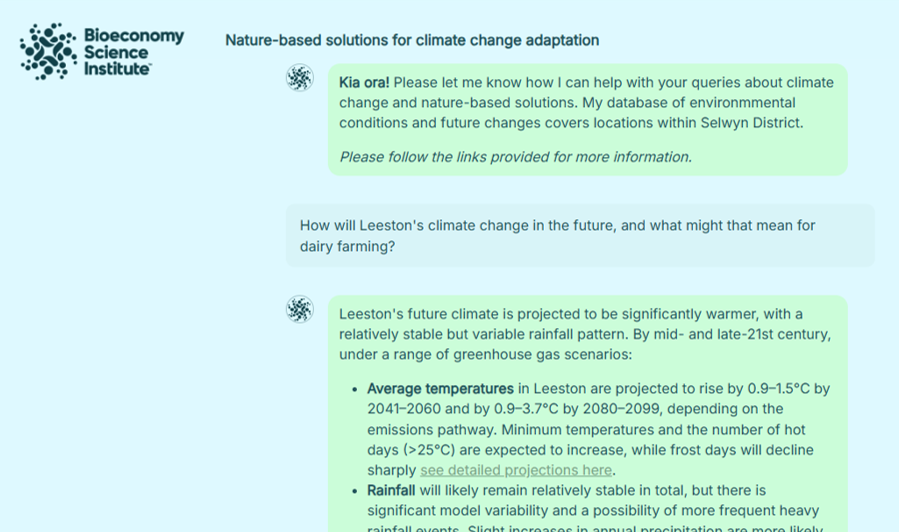
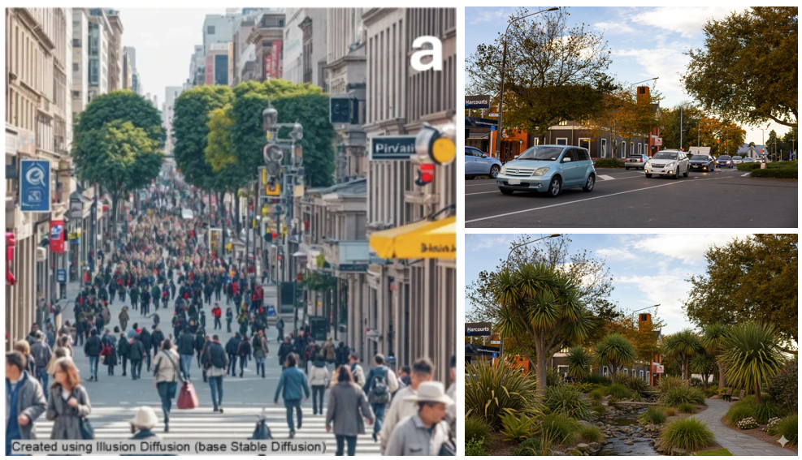
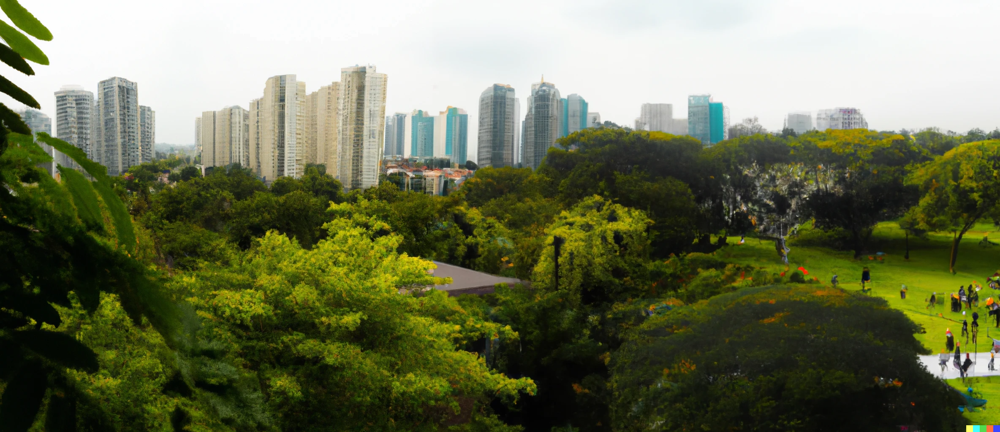
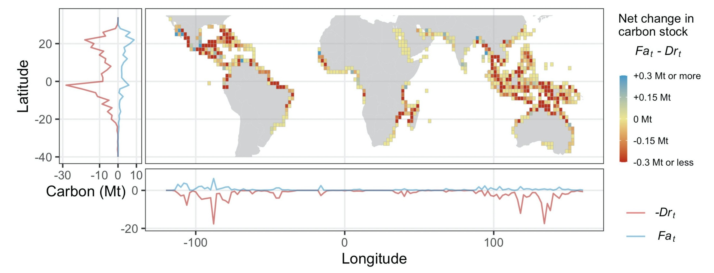
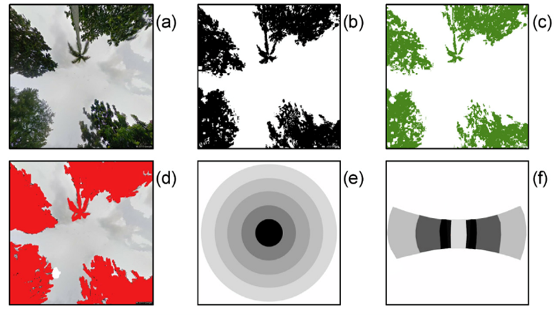

My research uses interdisciplinary approaches to analyse the relationships between nature and people.

### Climate adaptation

To adapt to climate change, people must design landscapes that store carbon, mitigate climate risks, enhance biodiversity, and support economic and societal well-being. To achieve ambitious adaptation, landscapes must integrate nature-based solutions. My work develops geospatial models to predict the impacts of nature-based solutions in the future, and applies these models to test alternative scenarios at local - global scales. Ongoing work in this area includes the collaborative 5 year research programme [Trees in landscapes \| Te Kapunipunitanga a Tāne Mahuta](https://www.landcareresearch.co.nz/discover-our-research/climate-change/trees-in-landscapes/).

### Generative AI

Generative artificial intelligence (GenAI) holds [potential](https://besjournals-onlinelibrary-wiley-com.landcareresearch.idm.oclc.org/doi/full/10.1002/pan3.10622) to transform the way that scientific information and advice is provided to decision-makers. However, this untested technology also holds substantial risks, including risks of misuse and misinformation, erroneous guidance, and ethical concerns. My research into GenAI as applied to environmental decision-making combines technology development with ethical and social research methods, to develop guidelines for responsible applications that support environmental outcomes alongside human interests and well-being.

#### Chatbots

I lead the 3-year [Harnessing GenAI](https://www.landcareresearch.co.nz/discover-our-research/environment/ai) MBIE Smart Idea project. Through this project we are building prototype GenAI chatbots and automated report pipelines to support farmers, district councils, and urban developers understand the risks of climate change and potential of nature-based solutions in their local area. The quality, risks, and ethics of these GenAI tools are a key concern, and we apply a range of social and ethical research methods to address this. Our recent [publication](https://www-sciencedirect-com.landcareresearch.idm.oclc.org/science/article/pii/S0169204626000393) used expert judgement to assess the quality of GenAI urban ecological reports, finding substantial human oversight was still required.

{fig-alt="gen-ai-portal" fig-align="center"} *Prototype platform to support climate change adaptation. View a test version [online here](https://drexrichards.shinyapps.io/ssi-v1/).*

#### Simulated human decisions

GenAI holds potential to add human-like realism into simulations of future global environmental change. Our recent [paper](https://iopscience.iop.org/article/10.1088/2515-7620/ae4cfb) demonstrates potential for this "simulated cognitive empathy" to improve our understanding of land use change and complex socio-environmental systems across diverse settings. We are working on future applications including agent-based modelling and synthetic populations of survey respondents.

#### Image generation
Images and videos created by GenAI hold great potential for use in research, for example in environmental economics [choice experiments](https://figshare.com/articles/poster/Newsletters_from_the_Generative_Artificial_Intelligence_for_climate_change_adaptation_research_project/31396194?file=62105010), or to communicate how future climate change or rewilding scenarios might look to key stakeholders. Simultaneously, GenAI images may be misused to miscommunicate or misinform environmental issues and decision-makers. Our research aims to improve the ecological accuracy of GenAI images, test their utility with potential end-users, and recommend approaches to ensure reliable and responsible use. 

{fig-alt="gen-ai-portal" fig-align="center"} *Example GenAI-created images. Left = subliminal message to support climate change action. Right = urban ecological restoration scenario visualisation.*

### Urban ecosystems

Urban ecosystems include parks, gardens, and remnant patches of natural vegetation. These ecosystems provide many critical benefits to society, including cooling the environment, cleaning the air, and providing spaces for recreation and relaxation. My research has looked at a broad range of these ecosystem services, using a mix of ecology, social sciences, and data analysis.

I'm interested in looking at urban ecosystems at a range of spatial scales. To inform urban planning and design, it is often useful to have high-resolution information on specific cities. For example, please take a look at some of my work in [Singapore](https://drexrichards.github.io/singapore) and [Ōtautahi - Christchurch](http://mwlr.nz/ncp-christchurch). It can also be useful to [zoom out](https://drexrichards.github.io/gue), and understand how cities around the world vary in their ecosystem types, covers, and configurations.

{fig-alt="sg-urban" fig-align="center"}

### Mangroves

Mangrove forests are a unique coastal ecosystem found mainly in the tropics. Mangroves have dense carbon stocks and can protect coastlines against natural hazards. However, they have been heavily deforested, often due to demands for fish, palm oil, and other products.

My work has analysed mangrove forest ecosystem services and pressures at individual sites, the hotspot region of Southeast Asia, and globally.

{fig-alt="Global mangrove carbon stock change" fig-align="center"}

*Global quantification of mangrove carbon stocks over 20 years. From [Richards et al. 2020](https://www.nature.com/articles/s41467-020-18118-z)*

### Data science

Quantifying the benefits of nature requires innovative approaches. My work has developed new ways of extracting useful information from large online datasets, for example using [social media data](https://www.sciencedirect.com/science/article/abs/pii/S2212041617301559) to understand how people use and appreciate parks and other outdoor spaces, or analysing the text of [historical books](https://link.springer.com/article/10.1007/s10531-013-0555-8) to understand trends in interest in different environmental issues. I have also written methods for quantifying structural parameters of vegetation using images from online panoramic photograph datasets.

{fig-alt="ge" fig-align="center" width="90%"}

*Processing of panoramic fisheye photographs to model shade provision. From [Richards and Edwards 2017](https://www.sciencedirect.com/science/article/abs/pii/S1470160X17300341)*
